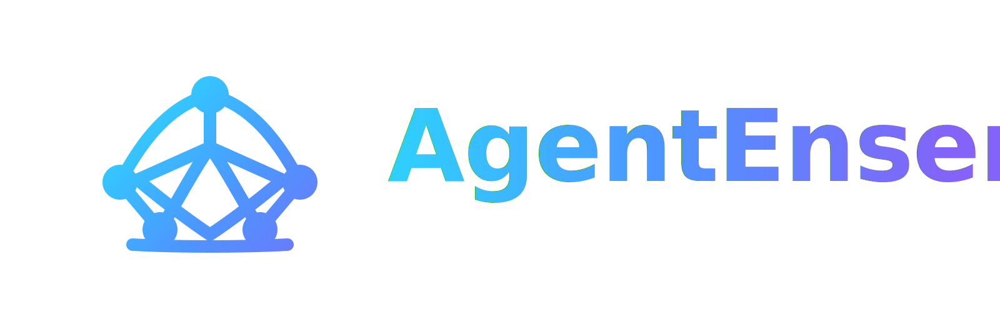

<p align="center">
  
</p>

<p align="center">An open-source Java 21 framework for orchestrating teams of AI agents that collaborate to accomplish complex tasks.</p>

---

Built natively in Java on top of [LangChain4j](https://github.com/langchain4j/langchain4j), AgentEnsemble is LLM-agnostic and supports any provider LangChain4j supports: OpenAI, Anthropic, Ollama, Azure OpenAI, Amazon Bedrock, Google Vertex AI, and more.

---

## Core Concepts

| Concept | Description |
|---|---|
| **Agent** | An AI entity with a role, goal, background, and optional tools |
| **Task** | A unit of work assigned to an agent, with a description and expected output |
| **Ensemble** | A group of agents working together on a sequence of tasks |
| **Tool** | A capability an agent can invoke (e.g., search, calculate) |
| **Tool Pipeline** | A chain of tools that execute sequentially inside a single LLM tool call, with no round-trips between steps |
| **Workflow** | How tasks are executed: `SEQUENTIAL`, `HIERARCHICAL` (manager delegates to workers), or `PARALLEL` (concurrent DAG-based execution) |
| **Memory** | Optional per-run and cross-run context: short-term, long-term (vector store), and entity memory |

**Full documentation:** [Core Concepts](https://docs.agentensemble.net/getting-started/concepts/) | [Getting Started](https://docs.agentensemble.net/getting-started/quickstart/)

---

## Quickstart

### 1. Add the dependency

**Gradle (Kotlin DSL):**
```kotlin
dependencies {
    // Import the BOM -- aligns all AgentEnsemble module versions
    implementation(platform("net.agentensemble:agentensemble-bom:2.0.0"))

    // Core framework -- always required
    implementation("net.agentensemble:agentensemble-core")

    // Optional modules -- no version needed, resolved from BOM
    implementation("net.agentensemble:agentensemble-memory")   // task-scoped memory
    implementation("net.agentensemble:agentensemble-review")   // human-in-the-loop gates

    // Optional: add only the built-in tools you need
    implementation("net.agentensemble:agentensemble-tools-calculator")
    implementation("net.agentensemble:agentensemble-tools-datetime")
    // Other tools: agentensemble-tools-json-parser, agentensemble-tools-file-read,
    // agentensemble-tools-file-write, agentensemble-tools-web-search,
    // agentensemble-tools-web-scraper, agentensemble-tools-process, agentensemble-tools-http

    // Optional: live execution dashboard (v2.1.0+) -- embedded WebSocket server that
    // streams task/tool/delegation events to a browser; browser-based review gates.
    // Add agentensemble-review if you also want browser-based review approval.
    implementation("net.agentensemble:agentensemble-web:2.1.0")           // optional

    // Add your preferred LangChain4j model provider:
    implementation("dev.langchain4j:langchain4j-open-ai:1.11.0")
}
```

### 2. Define tasks

In v2.0.0, agents are optional. The framework synthesizes them from task descriptions.
Declare the LLM once at the ensemble level:

```java
var model = OpenAiChatModel.builder()
    .apiKey(System.getenv("OPENAI_API_KEY"))
    .modelName("gpt-4o-mini")
    .build();

var researchTask = Task.builder()
    .description("Research the latest developments in {topic}")
    .expectedOutput("A 400-word summary covering current state, key players, and future outlook")
    .build();

var writeTask = Task.builder()
    .description("Write a blog post about {topic} based on the provided research")
    .expectedOutput("A 600-800 word blog post in markdown format, ready to publish")
    .context(List.of(researchTask))  // writer receives researcher's output as context
    .build();
```

### 3. Run the ensemble

```java
EnsembleOutput output = Ensemble.builder()
    .chatLanguageModel(model)   // default LLM for all synthesized agents
    .task(researchTask)
    .task(writeTask)
    // workflow inferred automatically from context declarations
    .build()
    .run(Map.of("topic", "AI agents"));

// Access the final task output
System.out.println(output.getRaw());

// Access all task outputs in order
for (TaskOutput taskOutput : output.getTaskOutputs()) {
    System.out.printf("[%s] %s%n", taskOutput.getAgentRole(), taskOutput.getRaw());
}

// Execution metadata
System.out.printf("Completed in %s, %d tool calls%n",
    output.getTotalDuration(), output.getTotalToolCalls());
```

**Zero-ceremony shorthand** for the simplest cases:

```java
EnsembleOutput output = Ensemble.run(model,
    Task.of("Research the latest developments in AI agents"),
    Task.of("Write a 600-word blog post from the research"));
```

---

## Hierarchical Workflow

With `Workflow.HIERARCHICAL`, a Manager agent is created automatically. It receives the full list of tasks and a description of each available worker agent. The Manager uses a `delegateTask` tool to dispatch tasks to the appropriate workers, then synthesizes their outputs into a final result.

You do not assign tasks to specific agents when using a hierarchical workflow -- the Manager decides which worker handles each task based on their roles and goals.

```java
var analyst = Agent.builder()
    .role("Data Analyst")
    .goal("Analyse datasets and surface key trends")
    .llm(model)
    .build();

var writer = Agent.builder()
    .role("Report Writer")
    .goal("Write clear executive-level reports from analytical findings")
    .llm(model)
    .build();

// In hierarchical workflow, tasks do not require an agent assignment
var analyseTask = Task.builder()
    .description("Analyse Q4 sales data and identify the top three trends")
    .expectedOutput("A structured analysis with three clearly identified trends")
    .agent(analyst)
    .build();

var reportTask = Task.builder()
    .description("Write an executive summary based on the Q4 sales analysis")
    .expectedOutput("A one-page executive summary suitable for board presentation")
    .agent(writer)
    .build();

EnsembleOutput output = Ensemble.builder()
    .agent(analyst)
    .agent(writer)
    .task(analyseTask)
    .task(reportTask)
    .workflow(Workflow.HIERARCHICAL)
    .managerLlm(model)           // LLM used by the Manager agent
    .managerMaxIterations(20)    // Max tool-call iterations for the Manager (default: 20)
    .build()
    .run();

// output.getRaw() contains the Manager's synthesised final result
// output.getTaskOutputs() contains each worker's output followed by the Manager's output
System.out.println(output.getRaw());
```

If `managerLlm` is not set, the Manager uses the first agent's LLM. All worker agents participate in the same memory context when memory is configured (see [Memory System](#memory-system) below).

**Custom manager prompts:** Use `.managerPromptStrategy(ManagerPromptStrategy)` to inject domain-specific context into the Manager's system and user prompts without forking framework internals. The built-in `DefaultManagerPromptStrategy.DEFAULT` is used when no strategy is set. See the [Workflows Guide](https://docs.agentensemble.net/guides/workflows/#customizing-the-manager-prompt) for full details.

**Full documentation:** [Workflows Guide](https://docs.agentensemble.net/guides/workflows/) | [Hierarchical Team Example](https://docs.agentensemble.net/examples/hierarchical-team/)

### Hierarchical Constraints

Add `HierarchicalConstraints` to impose deterministic guardrails on the delegation graph without losing the LLM-directed nature of the workflow:

```java
HierarchicalConstraints constraints = HierarchicalConstraints.builder()
    .requiredWorker("Researcher")        // must be called at least once
    .allowedWorker("Researcher")         // only these workers can be delegated to
    .allowedWorker("Analyst")
    .maxCallsPerWorker("Analyst", 2)     // Analyst may be called at most 2 times
    .globalMaxDelegations(5)             // total delegation cap across all workers
    .requiredStage(List.of("Researcher")) // stage 0: Researcher must complete first
    .requiredStage(List.of("Analyst"))    // stage 1: Analyst only after Researcher
    .build();

Ensemble.builder()
    .workflow(Workflow.HIERARCHICAL)
    .agent(researcher)
    .agent(analyst)
    .task(task)
    .hierarchicalConstraints(constraints)
    .build()
    .run();
```

Pre-delegation violations (disallowed worker, cap exceeded, stage order) are returned as error messages to the Manager LLM so it can adjust its plan. Post-execution, if a required worker was never called, a `ConstraintViolationException` is thrown with the full violation list and any partial worker outputs.

**Full documentation:** [Delegation Guide](https://docs.agentensemble.net/guides/delegation/#hierarchical-constraints)

---

## Parallel Workflow

With `Workflow.PARALLEL`, tasks execute concurrently using Java 21 virtual threads. The execution order is derived automatically from each task's `context` list -- tasks with no unmet dependencies start immediately and dependent tasks are unblocked as their prerequisites complete.

You do not mark tasks as "parallel" or "serial" explicitly. The framework determines maximum safe concurrency from the `context` declarations.

```java
// These two have no dependencies -- they run CONCURRENTLY
var researchTask = Task.builder()
    .description("Research AI trends")
    .expectedOutput("Research report")
    .agent(researcher)
    .build();

var dataTask = Task.builder()
    .description("Gather market data")
    .expectedOutput("Market data")
    .agent(analyst)
    .build();

// This depends on BOTH above -- starts only after both complete
var synthesisTask = Task.builder()
    .description("Synthesize findings into a report")
    .expectedOutput("Combined report")
    .agent(writer)
    .context(List.of(researchTask, dataTask))
    .build();

EnsembleOutput output = Ensemble.builder()
    .agent(researcher).agent(analyst).agent(writer)
    .task(researchTask).task(dataTask).task(synthesisTask)
    .workflow(Workflow.PARALLEL)
    .build()
    .run();
```

Execution timeline:
```
[researchTask]----+
                   +--> [synthesisTask]
[dataTask]--------+
```

**Task list order is irrelevant** for `PARALLEL` -- unlike `SEQUENTIAL`, you can list tasks in any order and the dependency graph will schedule them correctly.

**Error handling** is configurable via `parallelErrorStrategy`:

```java
Ensemble.builder()
    ...
    .workflow(Workflow.PARALLEL)
    .parallelErrorStrategy(ParallelErrorStrategy.FAIL_FAST)         // default: stop on first failure
    // or:
    .parallelErrorStrategy(ParallelErrorStrategy.CONTINUE_ON_ERROR) // finish independent tasks, report all failures
    .build();
```

When using `CONTINUE_ON_ERROR`, a `ParallelExecutionException` is thrown if any tasks fail, carrying both the successful outputs and a map of failures.

**Full documentation:** [Workflows Guide](https://docs.agentensemble.net/guides/workflows/) | [Parallel Workflow Example](https://docs.agentensemble.net/examples/parallel-workflow/)

### Dynamic Agent Creation

`Workflow.PARALLEL` works equally well when agents and tasks are constructed programmatically at
runtime. Because `Agent` and `Task` are plain Java objects, you can build them in a loop from any
dynamic collection -- the framework does not distinguish between statically-declared and
dynamically-constructed instances:

```java
List<Agent> specialistAgents = new ArrayList<>();
List<Task> dishTasks = new ArrayList<>();

for (OrderItem item : order.getItems()) {
    Agent specialist = Agent.builder()
            .role(item.getDish() + " Specialist")
            .goal("Prepare " + item.getDish())
            .llm(model)
            .build();

    Task dishTask = Task.builder()
            .description("Prepare the recipe for " + item.getDish())
            .expectedOutput("Recipe with ingredients, steps, and timing")
            .agent(specialist)
            .build();

    specialistAgents.add(specialist);
    dishTasks.add(dishTask);
}

// Fan-in: Head Chef aggregates all specialist outputs
Task mealPlan = Task.builder()
        .description("Coordinate all dish preparations into a final meal service plan.")
        .expectedOutput("Meal plan with serving order and timing.")
        .agent(headChef)
        .context(dishTasks)  // depends on ALL specialist tasks
        .build();

Ensemble.EnsembleBuilder builder = Ensemble.builder().workflow(Workflow.PARALLEL);
specialistAgents.forEach(builder::agent);
builder.agent(headChef);
dishTasks.forEach(builder::task);
builder.task(mealPlan);

EnsembleOutput output = builder.build().run();
// Specialists run concurrently; Head Chef runs after all specialists complete.
```

**Context size consideration:** with a large number of specialists each producing verbose output,
the aggregation task's context can become very large. Use `outputType(RecordClass.class)` on
specialist tasks to produce compact structured JSON, reducing aggregation context by 5-10x.
For very large N, use `MapReduceEnsemble` (see below) to aggregate results in bounded batches
across multiple levels.

**Full documentation:** [Dynamic Agent Creation Example](https://docs.agentensemble.net/examples/dynamic-agents/)

### MapReduceEnsemble (v2.0.0)

`MapReduceEnsemble` solves the context window overflow problem for large parallel workloads.
It supports two strategies -- **static** (`chunkSize`) and **adaptive** (`targetTokenBudget`):

#### Static mode (`chunkSize`)

The entire DAG is pre-built at `build()` time. Each reduce level groups at most `chunkSize`
outputs. Tree depth is O(log_K(N)):

```java
record DishResult(String dish, List<String> ingredients, int prepMinutes, String plating) {}

EnsembleOutput output = MapReduceEnsemble.<OrderItem>builder()
    .items(order.getItems())

    .mapAgent(item -> Agent.builder()
        .role(item.getDish() + " Chef")
        .goal("Prepare " + item.getDish())
        .llm(model)
        .build())
    .mapTask((item, agent) -> Task.builder()
        .description("Execute the recipe for: " + item.getDish())
        .expectedOutput("Recipe with ingredients, steps, and timing")
        .agent(agent)
        .outputType(DishResult.class)
        .build())

    .reduceAgent(() -> Agent.builder()
        .role("Sub-Chef")
        .goal("Consolidate dish preparations")
        .llm(model)
        .build())
    .reduceTask((agent, chunkTasks) -> Task.builder()
        .description("Consolidate these preparations.")
        .expectedOutput("Consolidated plan")
        .agent(agent)
        .context(chunkTasks)   // must wire context explicitly
        .build())

    .chunkSize(3)
    .build()
    .run();

// Inspect or export the pre-built DAG before execution
DagModel dag = DagExporter.build(mapReduceEnsemble);  // MAP/REDUCE/AGGREGATE badges
dag.toJson(Path.of("./traces/my-run.dag.json"));
```

#### Adaptive mode (`targetTokenBudget`)

Instead of a fixed `chunkSize`, the adaptive strategy measures actual output token counts
after each level and bin-packs groups that fit within the budget. The DAG shape is determined
at runtime:

```java
EnsembleOutput output = MapReduceEnsemble.<OrderItem>builder()
    .items(order.getItems())
    // ...same mapAgent, mapTask, reduceAgent, reduceTask factories as static mode...
    .reduceTask((agent, chunkTasks) -> Task.builder()
        .description("Consolidate these preparations.")
        .expectedOutput("Consolidated plan")
        .agent(agent)
        .context(chunkTasks)   // identical to static mode
        .build())

    // Adaptive: keep reducing until total context < 8000 tokens
    .targetTokenBudget(8_000)
    // Or derive from model context window:
    // .contextWindowSize(128_000).budgetRatio(0.5)  // budget = 64_000
    .maxReduceLevels(10)
    .build()
    .run();

// Post-execution DAG export (shape only known after run)
DagModel dag = DagExporter.build(output.getTrace());
output.getTrace().getMapReduceLevels().forEach(level ->
    System.out.printf("Level %d: %d tasks%n", level.getLevel(), level.getTaskCount()));
```

**Full documentation:** [MapReduceEnsemble Guide](https://docs.agentensemble.net/guides/map-reduce/) | [Kitchen Examples](https://docs.agentensemble.net/examples/map-reduce/)

---

## Memory System

AgentEnsemble supports three complementary memory types, all configured via `EnsembleMemory` on the `Ensemble`. At least one type must be enabled when a memory configuration is provided.

### Short-term memory

Accumulates every task output produced during a single `run()` call and injects it into each subsequent agent's prompt. When short-term memory is active it replaces the need to declare explicit `context` dependencies between tasks.

```java
EnsembleMemory memory = EnsembleMemory.builder()
    .shortTerm(true)
    .build();

EnsembleOutput output = Ensemble.builder()
    .agent(researcher)
    .agent(writer)
    .task(researchTask)
    .task(writeTask)
    .memory(memory)
    .build()
    .run(Map.of("topic", "AI agents"));
```

### Long-term memory

Persists task outputs across ensemble runs using a LangChain4j `EmbeddingStore`. Before each task begins, relevant past memories are retrieved by semantic similarity to the task description and injected into the agent's prompt.

```java
// Use any LangChain4j EmbeddingStore -- in-memory for development,
// durable (Chroma, Qdrant, Pinecone, etc.) for production
EmbeddingStore<TextSegment> store = new InMemoryEmbeddingStore<>();
EmbeddingModel embeddingModel = OpenAiEmbeddingModel.builder()
    .apiKey(System.getenv("OPENAI_API_KEY"))
    .modelName("text-embedding-3-small")
    .build();

LongTermMemory longTerm = new EmbeddingStoreLongTermMemory(store, embeddingModel);

EnsembleMemory memory = EnsembleMemory.builder()
    .longTerm(longTerm)
    .longTermMaxResults(5)  // Max memories retrieved per task (default: 5)
    .build();
```

### Entity memory

A key-value store of known facts about named entities. All facts are injected into every agent's prompt so agents share consistent, pre-seeded knowledge. Users populate entity memory before running the ensemble.

```java
EntityMemory entities = new InMemoryEntityMemory();
entities.put("Acme Corp", "A mid-sized SaaS company founded in 2015, publicly traded as ACME");
entities.put("Alice", "The lead researcher on this project, specialising in NLP");

EnsembleMemory memory = EnsembleMemory.builder()
    .entityMemory(entities)
    .build();
```

### Combining all three memory types

```java
EmbeddingStore<TextSegment> store = new InMemoryEmbeddingStore<>();
EmbeddingModel embeddingModel = OpenAiEmbeddingModel.builder()
    .apiKey(System.getenv("OPENAI_API_KEY"))
    .modelName("text-embedding-3-small")
    .build();

EntityMemory entities = new InMemoryEntityMemory();
entities.put("Acme Corp", "A mid-sized SaaS company founded in 2015");

EnsembleMemory memory = EnsembleMemory.builder()
    .shortTerm(true)
    .longTerm(new EmbeddingStoreLongTermMemory(store, embeddingModel))
    .entityMemory(entities)
    .longTermMaxResults(5)
    .build();

EnsembleOutput output = Ensemble.builder()
    .agent(researcher)
    .agent(writer)
    .task(researchTask)
    .task(writeTask)
    .memory(memory)
    .build()
    .run(Map.of("topic", "Acme Corp product strategy"));
```

### EnsembleMemory configuration

| Option | Type | Default | Description |
|---|---|---|---|
| `shortTerm` | `boolean` | `false` | Accumulate all task outputs within a run and inject into subsequent agents |
| `longTerm` | `LongTermMemory` | `null` | Cross-run vector-store persistence; use `EmbeddingStoreLongTermMemory` |
| `entityMemory` | `EntityMemory` | `null` | Named entity fact store; use `InMemoryEntityMemory` |
| `longTermMaxResults` | `int` | `5` | Maximum memories retrieved per task when long-term memory is enabled |

**Full documentation:** [Memory Guide](https://docs.agentensemble.net/guides/memory/) | [Memory Across Runs Example](https://docs.agentensemble.net/examples/memory-across-runs/)

---

## Agent Delegation

When an agent has `allowDelegation = true`, a `delegate` tool is automatically injected into its tool list at execution time. The agent can call this tool during its ReAct reasoning loop to hand off a subtask to any other registered agent.

```java
var leadResearcher = Agent.builder()
    .role("Lead Researcher")
    .goal("Coordinate research by delegating specialised subtasks to the right team member")
    .llm(model)
    .allowDelegation(true)    // enables the delegate tool
    .build();

var writer = Agent.builder()
    .role("Content Writer")
    .goal("Write clear, engaging content from research notes")
    .llm(model)
    .build();

var task = Task.builder()
    .description("Research AI trends and produce a polished blog post")
    .expectedOutput("An 800-word blog post about AI trends")
    .agent(leadResearcher)
    .build();

EnsembleOutput output = Ensemble.builder()
    .agent(leadResearcher)
    .agent(writer)
    .task(task)
    .maxDelegationDepth(3)    // prevent infinite recursion (default: 3)
    .build()
    .run();
```

During execution, the `leadResearcher` can call:
```
delegate("Content Writer", "Write an 800-word blog post about: [research findings]")
```

The framework executes the writer, returns the result as the tool output, and the researcher incorporates it into its final answer.

**Guards enforced automatically:**
- An agent cannot delegate to itself
- Delegating to an unknown agent role returns an error to the caller
- Delegation depth is capped at `maxDelegationDepth` (default 3) to prevent infinite chains

**Structured delegation contracts:** For each delegation attempt the framework constructs a `DelegationRequest` (with auto-generated `taskId`, priority, scope, and metadata fields) and produces a `DelegationResponse` (with `status`, `rawOutput`, `errors`, and `duration`). Guard failures also produce a `FAILURE` response, so every delegation attempt is auditable. See the [Delegation Guide](https://docs.agentensemble.net/guides/delegation/#structured-delegation-contracts) for the full field reference.

**Delegation policy hooks:** Register pluggable `DelegationPolicy` interceptors that run after built-in guards and before the worker executes. Each policy can allow, reject (with a reason), or modify the `DelegationRequest`. Policies are evaluated in registration order; the first rejection short-circuits worker execution.

```java
Ensemble.builder()
    .agent(coordinator)
    .agent(analyst)
    .task(task)
    .delegationPolicy((request, ctx) -> {
        if ("UNKNOWN".equals(request.getScope().get("project_key"))) {
            return DelegationPolicyResult.reject("project_key must not be UNKNOWN");
        }
        return DelegationPolicyResult.allow();
    })
    .build();
```

**Delegation lifecycle events:** `DelegationStartedEvent`, `DelegationCompletedEvent`, and `DelegationFailedEvent` are fired to all registered `EnsembleListener` instances. Each event carries a `delegationId` that correlates the start/complete/failed pair. Register listeners with `.onDelegationStarted(...)`, `.onDelegationCompleted(...)`, `.onDelegationFailed(...)`. See the [Delegation Guide](https://docs.agentensemble.net/guides/delegation/#delegation-lifecycle-events) for full details.

**Full documentation:** [Delegation Guide](https://docs.agentensemble.net/guides/delegation/)

---

## Agent Configuration

| Option | Type | Default | Description |
|---|---|---|---|
| `role` | `String` | required | The agent's role/title |
| `goal` | `String` | required | The agent's primary objective |
| `background` | `String` | `null` | Persona context for the system prompt |
| `tools` | `List<Object>` | `[]` | Tools the agent can use |
| `llm` | `ChatModel` | required | Any LangChain4j `ChatModel` |
| `allowDelegation` | `boolean` | `false` | Auto-injects a `delegate` tool; agent can delegate subtasks to peers |
| `verbose` | `boolean` | `false` | Log prompts and responses at INFO |
| `maxIterations` | `int` | `25` | Max tool-call iterations before forcing final answer |
| `responseFormat` | `String` | `""` | Extra formatting instructions in the system prompt |

**Full documentation:** [Agent Configuration Reference](https://docs.agentensemble.net/reference/agent-configuration/) | [Agents Guide](https://docs.agentensemble.net/guides/agents/)

---

## Structured Output

Set `outputType` on a task to have the agent produce JSON that is automatically parsed into a typed Java object. The framework generates a schema from the class, injects it into the prompt, and retries if parsing fails.

```java
record ResearchReport(String title, List<String> findings, String conclusion) {}

var researchTask = Task.builder()
    .description("Research the latest AI trends")
    .expectedOutput("A structured research report")
    .agent(researcher)
    .outputType(ResearchReport.class)  // agent prompted for JSON matching this schema
    .maxOutputRetries(3)               // retry on parse failure (default: 3)
    .build();

EnsembleOutput output = Ensemble.builder()
    .agent(researcher)
    .task(researchTask)
    .build()
    .run();

TaskOutput taskOutput = output.getTaskOutputs().get(0);

// Raw text is always available
System.out.println(taskOutput.getRaw());

// Typed access to the parsed result
ResearchReport report = taskOutput.getParsedOutput(ResearchReport.class);
System.out.println(report.title());
report.findings().forEach(System.out::println);
```

**How it works:**
1. The agent's prompt gains an `## Output Format` section with the JSON schema.
2. The framework extracts JSON from the response (handles plain JSON, markdown fences, and prose).
3. If parsing fails, a correction prompt is sent and the agent retries (up to `maxOutputRetries` times).
4. On exhaustion, `OutputParsingException` is thrown with the full error history.

**Supported types:** records, POJOs, `String`, numeric wrappers, `boolean`, `List<T>`, `Map<K,V>`, enums, nested objects.

**Formatted text (no schema):** For Markdown or other formatted prose, use `Agent.responseFormat` and a descriptive `expectedOutput` -- no `outputType` needed. The `TaskOutput.raw` field always contains the complete response.

**Full documentation:** [Structured Output Example](https://docs.agentensemble.net/examples/structured-output/)

---

## Callbacks and Event Listeners

Observe task and tool execution lifecycle events without modifying your agent or workflow configuration. Register lambda handlers directly on the builder, or implement the full `EnsembleListener` interface for reusable, multi-event listeners.

```java
EnsembleOutput output = Ensemble.builder()
    .agent(researcher)
    .agent(writer)
    .task(researchTask)
    .task(writeTask)
    .onTaskStart(event -> System.out.printf(
        "[%d/%d] Starting: %s%n",
        event.taskIndex(), event.totalTasks(), event.agentRole()))
    .onTaskComplete(event -> System.out.printf(
        "[%d/%d] Completed in %s%n",
        event.taskIndex(), event.totalTasks(), event.duration()))
    .onTaskFailed(event -> alertService.notify(event.cause()))
    .onToolCall(event -> metrics.increment("tool." + event.toolName()))
    .build()
    .run();
```

For reusable listeners that handle multiple event types, implement `EnsembleListener` directly:

```java
public class MetricsListener implements EnsembleListener {
    @Override
    public void onTaskComplete(TaskCompleteEvent event) {
        metrics.recordDuration(event.agentRole(), event.duration());
    }
    @Override
    public void onToolCall(ToolCallEvent event) {
        metrics.increment("tool." + event.toolName());
    }
    // onTaskStart and onTaskFailed default to no-ops
}

Ensemble.builder()
    .agent(researcher)
    .task(researchTask)
    .listener(new MetricsListener())   // full interface
    .onTaskFailed(e -> alertPager())   // lambda adds on top
    .build()
    .run();
```

**Task and tool events:** `TaskStartEvent`, `TaskCompleteEvent`, `TaskFailedEvent` (fired before exception propagates), `ToolCallEvent`.

**Delegation events:** `DelegationStartedEvent`, `DelegationCompletedEvent`, `DelegationFailedEvent`. Each carries a `delegationId` correlation key. Register with `.onDelegationStarted(...)`, `.onDelegationCompleted(...)`, `.onDelegationFailed(...)`. Guard and policy failures fire only `DelegationFailedEvent` (no start event).

**Exception safety:** if a listener throws, the exception is caught and logged. Execution continues and subsequent listeners are still called.

**Thread safety:** for `Workflow.PARALLEL`, listener methods may be called concurrently. Listener implementations must be thread-safe.

**Full documentation:** [Callbacks Guide](https://docs.agentensemble.net/guides/callbacks/) | [Callbacks Example](https://docs.agentensemble.net/examples/callbacks/)

---

## Metrics and Observability

Every ensemble run automatically produces execution metrics and a complete execution
trace -- no configuration required.

```java
EnsembleOutput output = ensemble.run();

// Per-run aggregates
ExecutionMetrics metrics = output.getMetrics();
System.out.println("Total tokens:  " + metrics.getTotalTokens());
System.out.println("LLM latency:   " + metrics.getTotalLlmLatency());
System.out.println("Tool time:     " + metrics.getTotalToolExecutionTime());

// Per-task breakdown
for (TaskOutput task : output.getTaskOutputs()) {
    TaskMetrics tm = task.getMetrics();
    System.out.printf("[%s] tokens=%d llm=%s%n",
        task.getAgentRole(), tm.getTotalTokens(), tm.getLlmLatency());
}
```

Token counts are `-1` when the LLM provider does not return usage metadata.

### Cost estimation

```java
Ensemble.builder()
    .costConfiguration(CostConfiguration.builder()
        .inputTokenRate(new BigDecimal("0.0000025"))
        .outputTokenRate(new BigDecimal("0.0000100"))
        .build())
    .build();

CostEstimate cost = output.getMetrics().getTotalCostEstimate();
// cost is null when token counts are unavailable
```

### Execution trace and JSON export

Every run produces a complete `ExecutionTrace` containing every LLM call, every tool
invocation with its arguments and result, all prompts sent, and delegation chains.

```java
// Export to JSON file
output.getTrace().toJson(Path.of("run-trace.json"));

// Get as string
String json = output.getTrace().toJson();
```

To export automatically after every run, register a `traceExporter`:

```java
Ensemble.builder()
    .traceExporter(new JsonTraceExporter(Path.of("traces/")))
    .build();
```

Each run writes a file named `{ensembleId}.json` inside the directory. Implement
`ExecutionTraceExporter` for custom destinations (databases, APIs, etc.).

See the [Metrics and Observability guide](docs/guides/metrics.md) and
[Metrics example](docs/examples/metrics.md) for full details.

---

## Live Execution Dashboard

The `agentensemble-web` module (v2.1.0) embeds a WebSocket server directly in the JVM
process. It streams real-time task, tool call, and delegation events to any browser and
optionally serves as the review handler for human-in-the-loop approval gates.

```java
import net.agentensemble.web.WebDashboard;

EnsembleOutput output = Ensemble.builder()
    .agent(researcher)
    .agent(writer)
    .task(researchTask)
    .task(Task.builder()
        .description("Write a report based on the research")
        .expectedOutput("A polished report")
        .review(Review.required())   // pause here for browser approval
        .build())
    .webDashboard(WebDashboard.onPort(7329))   // start server, wire listener + review handler
    .build()
    .run();
```

Open `http://localhost:7329` in a browser to see the live execution timeline. When a review
gate fires, the browser shows an approval panel with **Approve**, **Edit**, and **Exit Early**
controls. The server runs entirely in-process -- no Docker container and no npm command needed.

**Dependencies:**
```kotlin
implementation("net.agentensemble:agentensemble-web:2.1.0")
implementation("net.agentensemble:agentensemble-review:2.1.0")   // required for review gates
```

**Full documentation:** [Live Dashboard Guide](https://docs.agentensemble.net/guides/live-dashboard/) | [Live Dashboard Example](https://docs.agentensemble.net/examples/live-dashboard/)

---

## Execution Graph Visualization

Export the task dependency graph and execution timeline to JSON files with `agentensemble-devtools`,
then open them in the interactive `agentensemble-viz` viewer:

```java
// Export the planned DAG (no execution needed)
EnsembleDevTools.exportDag(ensemble, Path.of("./traces/"));

// Export the post-execution trace
EnsembleDevTools.exportTrace(output, Path.of("./traces/"));

// Or both in one call
EnsembleDevTools.export(ensemble, output, Path.of("./traces/"));
```

Open the viewer:

```bash
# Homebrew (macOS and Linux -- self-contained binary, no Node.js required)
brew install agentensemble/tap/agentensemble-viz
agentensemble-viz ./traces/

# Or via npx (no install)
npx @agentensemble/viz ./traces/
```

The viewer starts at `http://localhost:7329` and auto-discovers all `.dag.json` and `.trace.json`
files in the directory. The **Flow View** shows the dependency graph with critical-path highlighting;
the **Timeline View** shows a Gantt-chart breakdown of task, LLM call, and tool execution timing.

**Full documentation:** [Visualization Guide](https://docs.agentensemble.net/guides/visualization/) | [Visualization Example](https://docs.agentensemble.net/examples/visualization/)

---

## CaptureMode

`CaptureMode` transparently enables deep data collection -- full LLM conversation history,
enriched tool I/O, and wired memory operation counts -- across the entire execution pipeline
without any changes to agents, tasks, or tools.

**Three ways to activate -- no code change required:**

```bash
# Via JVM system property
java -Dagentensemble.captureMode=FULL -jar my-app.jar

# Via environment variable
AGENTENSEMBLE_CAPTURE_MODE=STANDARD java -jar my-app.jar
```

```java
// Programmatic (highest priority)
Ensemble.builder()
    .captureMode(CaptureMode.FULL)
    .build();
```

**Three levels:**

| Level | What is added |
|---|---|
| `OFF` | Base trace only (default -- zero overhead) |
| `STANDARD` | Full LLM message history per iteration + wired memory operation counts |
| `FULL` | STANDARD + auto-export to `./traces/` + enriched tool I/O (`parsedInput` maps) |

```java
// STANDARD: inspect the exact messages the LLM saw
EnsembleOutput output = Ensemble.builder()
    .agent(researcher)
    .task(researchTask)
    .captureMode(CaptureMode.STANDARD)
    .build()
    .run();

for (LlmInteraction iteration : output.getTrace().getTaskTraces().get(0).getLlmInteractions()) {
    for (CapturedMessage msg : iteration.getMessages()) {
        System.out.println("[" + msg.getRole() + "] " + msg.getContent());
    }
}
```

See the [CaptureMode guide](docs/guides/capture-mode.md) and
[CaptureMode examples](docs/examples/capture-mode.md) for full details.

---

## Guardrails

Add pluggable validation hooks to tasks to control what enters and exits agent execution:

```java
// Block before the LLM is called
InputGuardrail noPiiGuardrail = input -> {
    if (input.taskDescription().contains("SSN")) {
        return GuardrailResult.failure("Task contains PII");
    }
    return GuardrailResult.success();
};

// Validate after the agent responds
OutputGuardrail lengthGuardrail = output -> {
    if (output.rawResponse().length() > 5000) {
        return GuardrailResult.failure("Response exceeds 5000 characters");
    }
    return GuardrailResult.success();
};

var task = Task.builder()
    .description("Summarize the article")
    .expectedOutput("A concise summary")
    .agent(writer)
    .inputGuardrails(List.of(noPiiGuardrail))
    .outputGuardrails(List.of(lengthGuardrail))
    .build();
```

**Input guardrails** fire before the LLM call -- if any fails, `GuardrailViolationException` is thrown and no API call is made.

**Output guardrails** fire after the agent response (and after structured output parsing when `outputType` is set).

When a guardrail blocks a task, `GuardrailViolationException` propagates and is wrapped in `TaskExecutionException`, consistent with other task failures. The `TaskFailedEvent` callback fires before the exception propagates.

**Full documentation:** [Guardrails Guide](https://docs.agentensemble.net/guides/guardrails/)

---

## Task Configuration

| Option | Type | Default | Description |
|---|---|---|---|
| `description` | `String` | required | What the agent should do. Supports `{variable}` templates. |
| `expectedOutput` | `String` | required | What the output should look like |
| `agent` | `Agent` | required | The agent assigned to this task |
| `context` | `List<Task>` | `[]` | Prior tasks whose outputs feed into this task (sequential workflow) |
| `outputType` | `Class<?>` | `null` | Java class for structured output parsing. Records recommended. |
| `maxOutputRetries` | `int` | `3` | Retry attempts when structured output parsing fails. `0` disables retries. |
| `inputGuardrails` | `List<InputGuardrail>` | `[]` | Validation hooks that run before the LLM call. |
| `outputGuardrails` | `List<OutputGuardrail>` | `[]` | Validation hooks that run after the agent produces a response. |

**Full documentation:** [Task Configuration Reference](https://docs.agentensemble.net/reference/task-configuration/) | [Tasks Guide](https://docs.agentensemble.net/guides/tasks/)

---

## Ensemble Configuration

| Option | Type | Default | Description |
|---|---|---|---|
| `agents` | `List<Agent>` | required | All agents participating |
| `tasks` | `List<Task>` | required | All tasks to execute |
| `workflow` | `Workflow` | `SEQUENTIAL` | Execution strategy: `SEQUENTIAL`, `HIERARCHICAL`, or `PARALLEL` |
| `managerLlm` | `ChatModel` | first agent's LLM | LLM for the Manager agent (hierarchical workflow only) |
| `managerMaxIterations` | `int` | `20` | Max tool-call iterations for the Manager agent (hierarchical workflow only) |
| `managerPromptStrategy` | `ManagerPromptStrategy` | `DefaultManagerPromptStrategy.DEFAULT` | Builds the Manager's system and user prompts (hierarchical only). Implement to inject domain-specific context. |
| `parallelErrorStrategy` | `ParallelErrorStrategy` | `FAIL_FAST` | Error handling for parallel workflow: `FAIL_FAST` or `CONTINUE_ON_ERROR` |
| `memory` | `EnsembleMemory` | `null` | Memory configuration; see [Memory System](#memory-system) |
| `maxDelegationDepth` | `int` | `3` | Maximum peer-delegation depth when agents have `allowDelegation = true` |
| `verbose` | `boolean` | `false` | Elevates execution logging to INFO |
| `listener` | `EnsembleListener` | -- | Register a full listener implementation (repeatable) |
| `onTaskStart` | `Consumer<TaskStartEvent>` | -- | Lambda: fired before each task starts (repeatable) |
| `onTaskComplete` | `Consumer<TaskCompleteEvent>` | -- | Lambda: fired after each successful task (repeatable) |
| `onTaskFailed` | `Consumer<TaskFailedEvent>` | -- | Lambda: fired on task failure, before exception propagates (repeatable) |
| `onToolCall` | `Consumer<ToolCallEvent>` | -- | Lambda: fired after each tool call in the ReAct loop (repeatable) |
| `delegationPolicy` | `DelegationPolicy` | -- | Register a delegation policy (repeatable). Policies are evaluated in order before each worker invocation. Use `delegationPolicies(List)` for batch registration. |
| `onDelegationStarted` | `Consumer<DelegationStartedEvent>` | -- | Lambda: fired before each delegation handoff (passes all guards and policies). Carries a `delegationId` for correlation (repeatable). |
| `onDelegationCompleted` | `Consumer<DelegationCompletedEvent>` | -- | Lambda: fired after a delegation completes successfully. Carries a `delegationId` matching the start event (repeatable). |
| `onDelegationFailed` | `Consumer<DelegationFailedEvent>` | -- | Lambda: fired when a delegation fails (guard, policy, or worker exception). Guard/policy failures have no matching start event (repeatable). |
| `hierarchicalConstraints` | `HierarchicalConstraints` | `null` | Optional guardrails for the delegation graph (hierarchical workflow only): required workers, allowed workers, per-worker caps, global delegation cap, stage ordering. See [Hierarchical Constraints](#hierarchical-constraints). |

**Full documentation:** [Ensemble Configuration Reference](https://docs.agentensemble.net/reference/ensemble-configuration/)

---

## Creating Tools

### Option 1: Implement `AgentTool`

```java
public class WebSearchTool implements AgentTool {
    public String name() { return "web_search"; }
    public String description() { return "Search the web. Input: a search query string."; }
    public ToolResult execute(String input) {
        String results = performSearch(input);
        return ToolResult.success(results);
    }
}

var agent = Agent.builder()
    .role("Researcher")
    .goal("Find information")
    .tools(List.of(new WebSearchTool()))
    .llm(model)
    .build();
```

### Option 2: Use LangChain4j `@Tool` annotation

```java
public class MathTools {
    @Tool("Calculate a mathematical expression. Input: an expression like '2 + 3'.")
    public double calculate(String expression) {
        return evaluateExpression(expression);
    }
}

var agent = Agent.builder()
    .role("Analyst")
    .goal("Analyze data")
    .tools(List.of(new MathTools()))
    .llm(model)
    .build();
```

Both approaches can be combined in a single agent's tool list.

### Option 3: Chain tools with `ToolPipeline`

`ToolPipeline` wraps multiple tools into a single compound tool that the LLM calls once. All steps execute inside that single call with no LLM round-trips between them -- reducing token cost and latency for deterministic data-transformation chains.

```java
import net.agentensemble.tool.ToolPipeline;
import net.agentensemble.tool.PipelineErrorStrategy;

// JsonParserTool extracts a price; adapter reshapes it; CalculatorTool applies markup
ToolPipeline priceCalculator = ToolPipeline.builder()
    .name("extract_and_calculate")
    .description("Extracts the base_price field from a JSON payload and returns the "
        + "price with a 10% markup applied. Input: JSON with a product object.")
    .step(new JsonParserTool())
    .adapter(result -> result.getOutput() + " * 1.1")
    .step(new CalculatorTool())
    .errorStrategy(PipelineErrorStrategy.FAIL_FAST)
    .build();

// Register on a task -- the LLM sees one tool and calls it once
var task = Task.builder()
    .description("Calculate the retail price from the product data")
    .tools(List.of(priceCalculator))
    .build();
```

**Full documentation:** [Tool Pipeline Guide](https://docs.agentensemble.net/guides/tool-pipeline/) | [Tool Pipeline Example](https://docs.agentensemble.net/examples/tool-pipeline/) | [Tools Guide](https://docs.agentensemble.net/guides/tools/)

---

## Template Variables

Use `{variable}` placeholders in task descriptions and expected outputs:

```java
var task = Task.builder()
    .description("Research {topic} in {year}")
    .expectedOutput("A report on {topic}")
    .agent(researcher)
    .build();

// Resolve at run time:
ensemble.run(Map.of("topic", "quantum computing", "year", "2026"));
```

Use `{{variable}}` to include a literal `{variable}` in the text without substitution.

**Full documentation:** [Template Variables Guide](https://docs.agentensemble.net/guides/template-variables/)

---

## Error Handling

```java
try {
    EnsembleOutput output = ensemble.run();
} catch (ValidationException e) {
    // Invalid configuration (bad agent/task setup)
    System.err.println("Configuration error: " + e.getMessage());
} catch (TaskExecutionException e) {
    // A task failed during execution
    System.err.println("Task failed: " + e.getTaskDescription());
    System.err.println("Agent: " + e.getAgentRole());

    // Partial results from tasks that completed before the failure
    for (TaskOutput completed : e.getCompletedTaskOutputs()) {
        System.out.println("Completed: " + completed.getTaskDescription());
    }
} catch (PromptTemplateException e) {
    // Missing template variables
    System.err.println("Missing variables: " + e.getMissingVariables());
}
```

**Full documentation:** [Error Handling Guide](https://docs.agentensemble.net/guides/error-handling/)

---

## Logging

AgentEnsemble uses SLF4J. Add your preferred implementation (Logback, Log4j2, etc.) to your project.

**Logback example with MDC support:**

```xml
<configuration>
    <appender name="CONSOLE" class="ch.qos.logback.core.ConsoleAppender">
        <encoder>
            <pattern>%d{HH:mm:ss} %-5level [%X{ensemble.id:-}] [%X{task.index:-}] [%X{agent.role:-}] %logger{36} - %msg%n</pattern>
        </encoder>
    </appender>
    <logger name="net.agentensemble" level="INFO"/>
    <root level="INFO"><appender-ref ref="CONSOLE"/></root>
</configuration>
```

**MDC keys available during execution:**

| Key | Example Value |
|---|---|
| `ensemble.id` | UUID per `run()` call |
| `task.index` | `"2/5"` |
| `agent.role` | `"Senior Research Analyst"` |

**Full documentation:** [Logging Guide](https://docs.agentensemble.net/guides/logging/)

---

## Running the Examples

Clone the repo, set your API key, and run any of the included examples:

```bash
git clone https://github.com/AgentEnsemble/agentensemble.git
cd agentensemble
export OPENAI_API_KEY=your-api-key

# Research and writer pipeline (sequential workflow)
./gradlew :agentensemble-examples:runResearchWriter
./gradlew :agentensemble-examples:runResearchWriter --args="quantum computing"

# Hierarchical team -- manager coordinates specialists
./gradlew :agentensemble-examples:runHierarchicalTeam
./gradlew :agentensemble-examples:runHierarchicalTeam --args="Acme Corp"

# Parallel workflow -- concurrent DAG-based execution
./gradlew :agentensemble-examples:runParallelWorkflow
./gradlew :agentensemble-examples:runParallelWorkflow --args="Acme Corp enterprise software"

# Dynamic agent creation -- fan-out/fan-in with runtime-constructed agents
./gradlew :agentensemble-examples:runDynamicAgents
./gradlew :agentensemble-examples:runDynamicAgents --args="Risotto Steak Tiramisu"

# MapReduceEnsemble (static) -- tree-reduction DAG with bounded context per reducer
./gradlew :agentensemble-examples:runMapReduceKitchen

# MapReduceEnsemble (adaptive) -- token-budget-driven reduction
./gradlew :agentensemble-examples:runMapReduceAdaptiveKitchen

# Memory across runs -- long-term memory over 3 weekly cycles
./gradlew :agentensemble-examples:runMemoryAcrossRuns

# Structured output -- typed JSON + formatted Markdown
./gradlew :agentensemble-examples:runStructuredOutput
./gradlew :agentensemble-examples:runStructuredOutput --args="quantum computing"

# Callbacks -- event listeners observing task and tool lifecycle
./gradlew :agentensemble-examples:runCallbacks
./gradlew :agentensemble-examples:runCallbacks --args="the future of AI agents"

# Tool Pipeline -- chain tools into a single LLM call, no round-trips between steps
./gradlew :agentensemble-examples:runToolPipeline
```

**Full documentation:** [Examples](https://docs.agentensemble.net/examples/research-writer/)

---

## Building from Source

```bash
./gradlew build       # Compile and run all tests
./gradlew test        # Run tests only
```

---

## Design Documentation

See [`docs/design/`](docs/design/) for full specifications:

- [01 - Overview](docs/design/01-overview.md)
- [02 - Architecture](docs/design/02-architecture.md)
- [03 - Domain Model](docs/design/03-domain-model.md)
- [04 - Execution Engine](docs/design/04-execution-engine.md)
- [05 - Prompt Templates](docs/design/05-prompt-templates.md)
- [06 - Tool System](docs/design/06-tool-system.md)
- [07 - Template Resolver](docs/design/07-template-resolver.md)
- [08 - Error Handling](docs/design/08-error-handling.md)
- [09 - Logging](docs/design/09-logging.md)
- [10 - Concurrency](docs/design/10-concurrency.md)
- [11 - Configuration Reference](docs/design/11-configuration.md)
- [12 - Testing Strategy](docs/design/12-testing-strategy.md)
- [13 - Future Roadmap](docs/design/13-future-roadmap.md)
- [14 - MapReduceEnsemble](docs/design/14-map-reduce.md)
- [15 - v2.0.0 Architecture](docs/design/15-v2-architecture.md)
- [16 - Live Execution Dashboard](docs/design/16-live-dashboard.md)
- [17 - Tool Pipeline](docs/design/17-tool-pipeline.md)

---

## Documentation

Full documentation is available at **[docs.agentensemble.net](https://docs.agentensemble.net)**:

| Section | Description |
|---|---|
| [Getting Started](https://docs.agentensemble.net/getting-started/installation/) | Installation, quickstart, core concepts |
| [Guides](https://docs.agentensemble.net/guides/agents/) | Agents, tasks, workflows, tools, memory, delegation, error handling, logging, visualization |
| [Reference](https://docs.agentensemble.net/reference/ensemble-configuration/) | Complete configuration field tables |
| [Examples](https://docs.agentensemble.net/examples/research-writer/) | Runnable annotated example walkthroughs including [visualization](https://docs.agentensemble.net/examples/visualization/) |
| [Design Specs](docs/design/) | Internal architecture and design documentation |

---

## What's Next (Roadmap)

| Phase | Features |
|---|---|
| ~~v0.2.0~~ | ~~Hierarchical workflow (manager agent delegates)~~ |
| ~~v0.3.0~~ | ~~Memory system (short-term, long-term, entity)~~ |
| ~~v0.4.0~~ | ~~Agent delegation~~ |
| ~~v0.5.0~~ | ~~Parallel workflow (virtual threads)~~ |
| ~~v0.6.0~~ | ~~Structured output (typed output parsing)~~ |
| ~~v0.7.0~~ | ~~Callbacks and event listeners~~ |
| ~~v0.8.0~~ | ~~Guardrails: pre/post execution validation~~ |
| ~~v1.0.0~~ | ~~Built-in tool library (agentensemble-tools module)~~ |
| ~~v2.0.0~~ | ~~MapReduceEnsemble: static tree-reduction DAG with chunkSize~~ |
| ~~v2.0.0~~ | ~~MapReduceEnsemble: adaptive reduction with targetTokenBudget~~ |
| ~~v2.1.0~~ | ~~Live Execution Dashboard: real-time browser GUI, browser-based review approval~~ |
| Future | MCP (Model Context Protocol) integration, GraalVM polyglot tools |

---

## Contributing

Contributions are welcome. Please open an issue to discuss proposed changes before submitting a pull request.

---

## License

MIT License. See [LICENSE](LICENSE).
